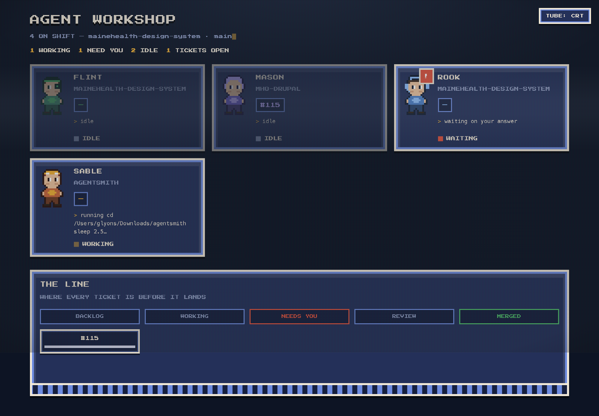

# Agent Workshop

A live dashboard for your Claude Code sessions, styled as a SNES/CRT pixel-art
workshop. Every open session shows up as a person at a desk — with the ticket
they're on, what they're doing right now, and whether they're **working**,
**idle**, or **need you** (a permission prompt or a question). A "THE LINE"
kanban strip tracks where each ticket sits.



It connects to your sessions two ways, working together:

- **Hooks** (real time) — Claude Code calls `hooks/status.ts` on session events,
  so activity, permission prompts, and questions show up the instant they happen.
- **Transcript scanner** (fills the gaps) — the server periodically reads your
  session transcripts under `~/.claude/projects`, so windows you already have
  open appear immediately, without waiting for them to act or be restarted. It
  only surfaces a session if a matching **running `claude` process** exists, so
  old transcripts and internal sub-sessions don't show up as phantom agents.

Both write one status file per session to `~/.agent-status/<session_id>.json`,
keyed by the real session id so they never double-count a session.

## Quick start

```bash
bun install
bun run install-hooks   # merges the hooks into ~/.claude/settings.json (backs it up first)
bun run dev             # builds if needed, starts the dashboard, prints the URL
```

Open the printed URL. Your currently-open sessions appear right away (via the
scanner). New sessions report automatically via the hooks; **sessions you
already have open won't fire hooks until you restart them**, but the scanner
keeps showing them in the meantime.

> `bun run dev` serves the pre-built `dist/`. After changing anything under
> `src/ui`, run `bun run build` to rebuild it (`dist/` is not tracked).

## Connecting your sessions

### `bun run install-hooks` (recommended)

Installs the hooks at the **user level** (`~/.claude/settings.json`) so *every*
session in *every* project reports. The installer:

- backs up your existing settings to `~/.claude/settings.json.agentworkshop.bak`,
- adds the five events (`SessionStart`, `PreToolUse`, `Notification`, `Stop`,
  `SessionEnd`) only if they aren't already present (non-destructive, idempotent),
- uses absolute paths to `bun` and this repo's `hooks/status.ts`.

Undo any time with `bun run uninstall-hooks` (removes only this repo's hook
entries; anything else you have stays).

### Per-project instead of global

If you'd rather monitor just one project, copy this repo's `.claude/settings.json`
into that project (or merge its `hooks` block), and make each command an absolute
path to this repo's `hooks/status.ts`.

### Just the scanner, no hooks

`bun run dev` scans transcripts on its own, so you get a read-only view of open
sessions even without installing hooks. You lose only the real-time signals the
transcript can't see — most importantly, **permission prompts** flipping a
session to "need you" the moment they appear.

## How a session becomes a person

- **name / sprite** — a stable codename + pixel look derived from the session id,
  so each window is a distinct, recognizable character. A branch that matches a
  known kind of work (component, docs, tests, migration, triage) gets that
  persona instead.
- **role line** — the repo the session is working in (or the matched work type).
- **ticket** — parsed from the git branch (`fix/115-primary-nav` → `#115`).
- **doing** — the current tool activity, humanized (`editing card.twig`,
  `running bun test`; long shell commands are clipped to one line).
- **state** — `working` while active; `waiting` for a permission prompt or a
  question it ended its turn on; `idle` otherwise.

## Controls

The desks are interactive:

- **Click a desk → jump to that session's Ghostty terminal.** The server focuses
  the exact terminal (it writes a one-shot title marker to the session's tty and
  matches it via Ghostty's AppleScript dictionary; falls back to matching the
  working directory). macOS + Ghostty only.
- **✎ (hover) → rename** the agent. The custom name is stored in
  `~/.agent-status/.overrides.json` and survives restarts.
- **⏸ (hover) → pause** the agent — interrupts its current turn (like pressing
  Esc/Ctrl-C once). The session stays open; resume by typing in it. Confirmed
  before it fires.

Precise focus and pause need the **pid + tty the hooks capture**, so they work
best with `install-hooks`. A scanner-only session (no hooks) falls back to
cwd-level focus and can't be paused (the button reports this).

### Branch resolution (no `jq` needed)

Claude Code's hook payload doesn't include the git branch, so `hooks/status.ts`
resolves it in `main()` by shelling `git -C <cwd> branch --show-current` when the
event has none. `applyEvent` itself stays pure. (The transcript scanner reads the
`gitBranch` field the transcript already records.)

### `AGENT_STATUS_DIR`

Status files live in `~/.agent-status/` by default. Point the hook, the scanner,
and the server elsewhere with `AGENT_STATUS_DIR` (used for isolated testing).
`AGENT_SCAN_FRESH_MS` controls how recently a transcript must have changed to
count as "open" (default 15 min).

## Manual smoke test

```bash
echo '{"hook_event_name":"SessionStart","session_id":"smoke1","cwd":"'$PWD'"}' | bun run hooks/status.ts
cat ~/.agent-status/smoke1.json     # state: "working"

echo '{"hook_event_name":"Notification","session_id":"smoke1","cwd":"'$PWD'"}' | bun run hooks/status.ts
cat ~/.agent-status/smoke1.json     # state: "waiting", waitingReason: "permission"

echo '{"hook_event_name":"SessionEnd","session_id":"smoke1","cwd":"'$PWD'"}' | bun run hooks/status.ts
ls ~/.agent-status/smoke1.json      # gone
```

`bun run scan` runs one scan pass over your real transcripts and reports how many
open sessions it wrote.

## THE LINE

THE LINE places each session's current work item — labelled by ticket (`#123`)
if the branch has a number, else a short branch name, else the repo — into
`backlog` (idle), `working`, or `needs-you` (waiting) from live session state.
`review` and `merged` stay empty: filling them needs PR/MR and merge state from
GitHub/GitLab, beyond what sessions expose. Out of scope for v1.

## Testing

```bash
bun test                              # unit tests (pure logic)
bunx tsc --noEmit -p tsconfig.json    # typecheck
```
