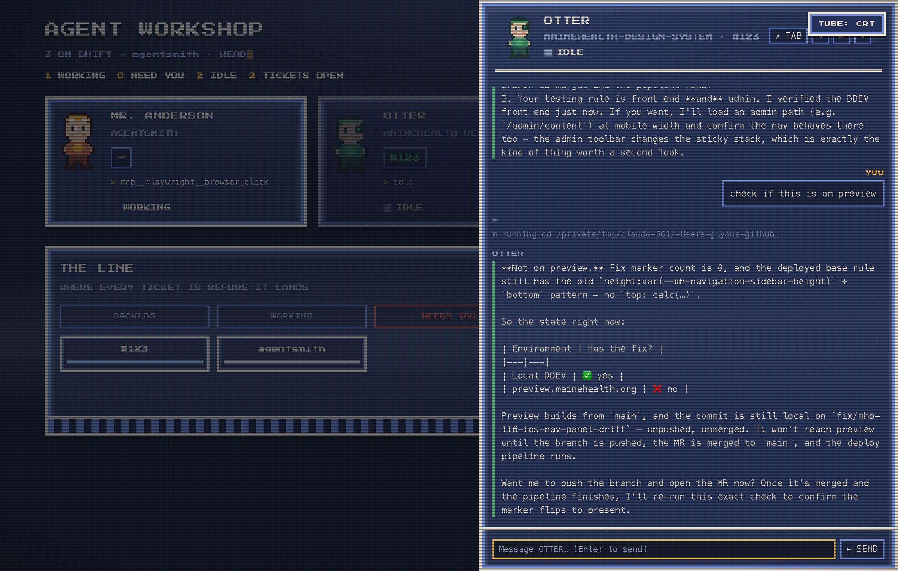
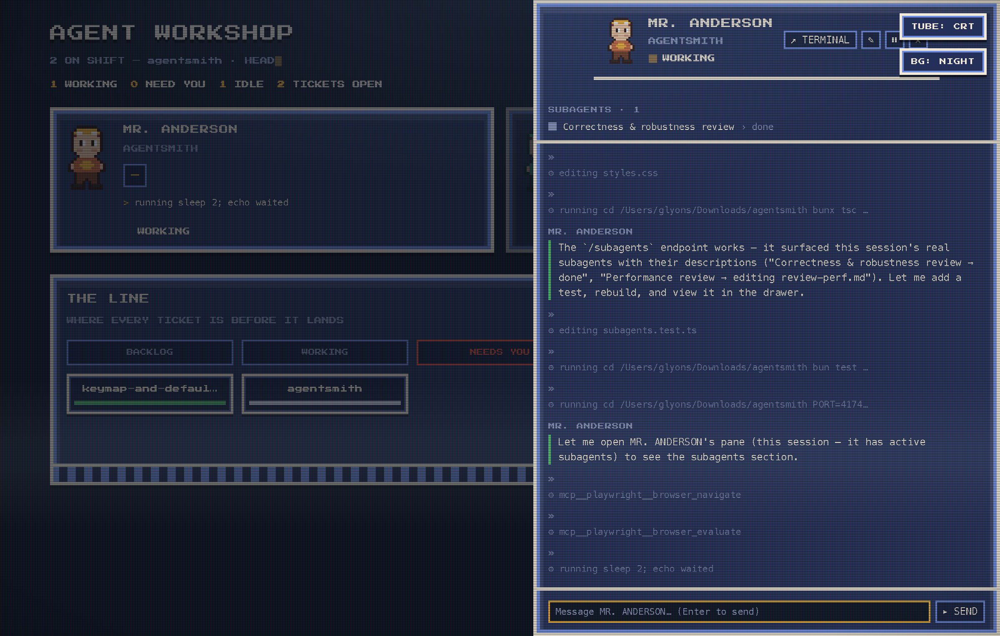
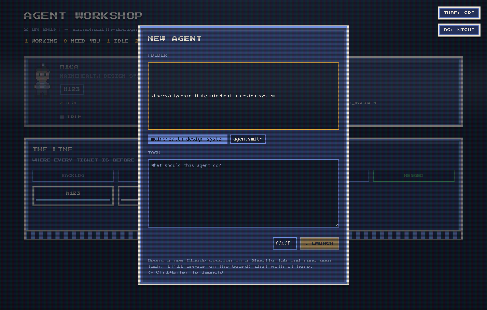
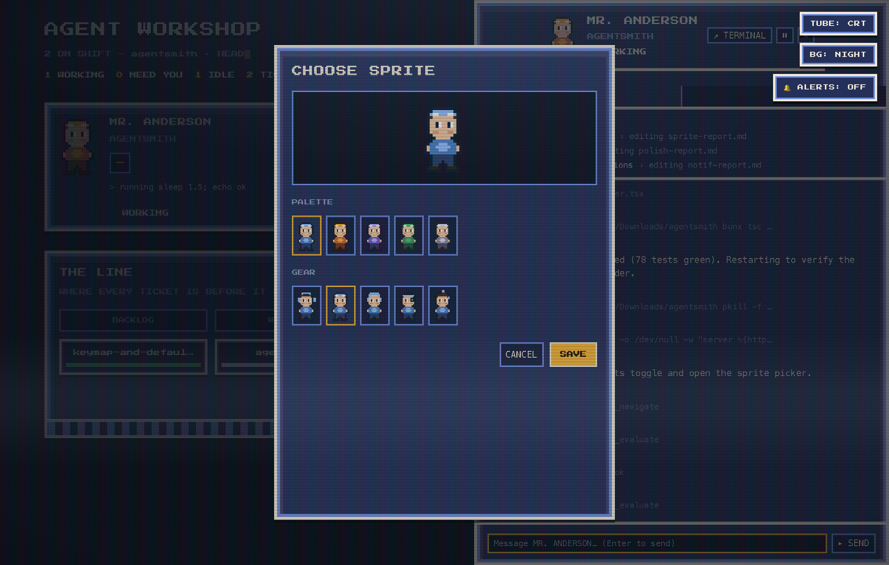

# Agent Workshop

A live board of your open Claude Code sessions, styled as a SNES/CRT pixel-art
workshop. Every open session shows up as a person at a desk — with the ticket
they're on, what they're doing right now, whether they're **working**, **idle**,
or **need you** (a permission prompt or a question), and a badge when they have
active subagents. "THE LINE" kanban strip tracks where each ticket sits.


It connects to your sessions two ways, working together:

- **Hooks** (real time) — Claude Code calls `hooks/status.ts` on session events,
  so activity, permission prompts, and questions show up the instant they happen.
  A permission prompt leaves **no trace in the transcript**, so it's the one thing
  only the hooks can see: without them installed, a session stopped at a permission
  prompt reads as **working** (busy on the tool), not **needs you**. Install the
  hooks if you want permission prompts on the board.
- **Transcript scanner** (fills the gaps) — the server periodically reads your
  session transcripts under `~/.claude/projects`, so windows you already have
  open appear immediately, without waiting for them to act or be restarted. It
  only surfaces a session if a matching **running `claude` process** exists, so
  old transcripts and internal sub-sessions don't show up as phantom agents.

Both write one status file per session to `~/.agent-status/<session_id>.json`,
keyed by the real session id so they never double-count a session.

## Quick start

```bash
bun install
bun run install-hooks   # recommended — required to see permission prompts (see above)
bun run dev             # builds if needed, starts the dashboard, prints the URL
```

Open the printed URL. Your currently-open sessions appear right away (via the
scanner). New sessions report automatically via the hooks; sessions you already
have open won't fire hooks until you restart them, but the scanner keeps
showing them in the meantime.

> `bun run dev` serves the pre-built `dist/`. After changing anything under
> `src/ui`, run `bun run build` to rebuild it (`dist/` is not tracked).

### Scripts

| Command | What it does |
| --- | --- |
| `bun run dev` | Starts the dashboard server (with the scanner running) and prints its URL |
| `bun run build` | Builds `src/ui` into `dist/` (minified) — run after any UI change |
| `bun test` | Runs the unit test suite |
| `bun run scan` | Runs one scan pass over your real transcripts, reports how many open sessions it wrote |
| `bun run install-hooks` | Merges the status hooks into `~/.claude/settings.json` (backs it up first) |
| `bun run uninstall-hooks` | Removes only this repo's hook entries |

## Connecting your sessions

### `bun run install-hooks` (recommended)

Installs the hooks at the **user level** (`~/.claude/settings.json`) so *every*
session in *every* project reports. The installer:

- backs up your existing settings to `~/.claude/settings.json.agentworkshop.bak`,
- adds the five events (`SessionStart`, `PreToolUse`, `Notification`, `Stop`,
  `SessionEnd`) only if they aren't already present (non-destructive, idempotent),
- uses absolute paths to `bun` and this repo's `hooks/status.ts`.

Undo any time with `bun run uninstall-hooks` (removes only this repo's hook
entries; anything else you have stays).

### Just the scanner, no hooks

`bun run dev` scans transcripts on its own, so you get a read-only view of open
sessions even without installing hooks. You lose the real-time signals the
transcript can't see — most importantly, **permission prompts** flipping a
session to "need you" the moment they appear — and precise terminal targeting
for focus/prompt/pause (see below).

## The board

Each open session is a pixel character with:

- **name / sprite** — a stable codename + pixel look derived from the session
  id (a branch matching a known kind of work — component, docs, tests,
  migration, triage — gets that persona), or a character you've picked yourself.
- **role line** — the repo the session is working in (or the matched work type).
- **ticket** — parsed from the git branch (`fix/115-primary-nav` → `#115`).
- **doing** — the current tool activity, humanized (`editing card.twig`,
  `running bun test`; long shell commands are clipped to one line).
- **state** — `working` while active; `waiting` ("NEED YOU") for a permission
  prompt or a question it ended its turn on; `idle` otherwise.
- **subagent badge** — a small `⊂N` badge when the session has active `Task`
  subagents (a parent delegating to subagents is shown as working, not idle).

### THE LINE

A kanban strip that follows each work item — labelled by ticket (`#123`) if the
branch has a number, else a short branch name, else the repo — left to right
along a git lifecycle:

| stage | meaning | source |
| --- | --- | --- |
| `BACKLOG` | idle, not begun (no commits yet) | live session state |
| `WORKING` | actively running | live session state |
| `NEEDS YOU` | waiting on a permission/question | live session state |
| `DONE` | committed but not pushed anywhere | `git rev-list --count HEAD --not --remotes > 0` |
| `REVIEW` | you're reviewing it | **your** manual move |
| `MERGED` | you've merged it | **your** manual move |

**Click** a crate to open its conversation pane. **Drag** a crate between
`DONE` / `REVIEW` / `MERGED` to set where it sits — dragging back to `DONE`
clears your designation. The three live columns are derived, so they don't
accept drops.

Your `REVIEW` / `MERGED` moves are stored in `~/.agent-status/.line.json`,
keyed by item (`repo|label`), so they survive restarts **and are readable by
any agent** — that's how a session becomes aware of what you've already reviewed
or merged. A designated item keeps its crate even after its session ends.

```jsonc
// ~/.agent-status/.line.json
{ "agentsmith|#123": { "stage": "review", "label": "#123", "sessionId": "…" } }
```

## The agent pane

Click a desk to open its pane, with two tabs:

- **CHAT** — the full conversation, with markdown rendering (code, tables,
  bold). Send a message any time; it's echoed optimistically before the
  transcript confirms it. If the session ended a turn on a multiple-choice
  question (`AskUserQuestion`), the options render inline so you can answer
  without switching to the terminal. A **subagents** section lists the
  session's live subagents with their description and current activity.
- **INFO** — pwd, branch (+ ticket), working-tree status, and recent commits.




## Controls

- **Click the sprite** (on a desk or in the pane) to pick a custom character —
  a character + palette + gear picker, overriding the deterministic default.
  Characters include the human **worker** and **engineer** plus standalone
  critters/droids — **cat**, **fox**, **owl**, **robot** — each recolored by any
  of the five palettes. (Gear overlays apply only to the human worker.)
- **↗ TERMINAL** jumps to the session's exact Ghostty tab.
- **Click the name** (in the pane) to rename the agent. Stored in
  `~/.agent-status/.overrides.json` and survives restarts.
- **⏸ pause** interrupts the agent's current turn (like pressing Esc/Ctrl-C
  once). The session stays open; resume by typing in it. Confirmed before it
  fires.
- **◼ stop** ends the agent — it closes the session's Ghostty tab. Confirmed
  before it fires (two-step). Targets the exact tab (marker/title), never a
  cwd guess.
- **Send a prompt or answer** from the UI — types the text into the session's
  terminal and submits it, without ever focusing/activating the terminal (you
  stay in the web UI).
- **+ NEW AGENT** launches a brand-new Claude session: pick a folder (recent
  folders are offered), a task, and optionally a model (Opus/Sonnet/Haiku) and
  permission mode (Default/Plan/Accept edits/Bypass). It opens in a new Ghostty
  tab running `claude [--model …] [--permission-mode …] '<task>'` and appears on
  the board via the scanner once it starts.




Precise focus/prompt/pause need the pid + tty the hooks capture, so they work
best with `install-hooks`. A scanner-only session (no hooks) falls back to
cwd-level focus and can't be paused (the button reports this).

## Alerts

The **🔔 ALERTS** toggle (top of the board) fires a desktop notification plus a
short synthesized beep the moment a session transitions into "need you". It's
off by default, remembers your choice, and only alerts on *new* transitions —
not for sessions already waiting when you load the page.

## Backgrounds

The **BG** button cycles five self-contained CSS art backgrounds — night,
stars, synth, grid, dusk — and remembers your pick. Each carries a very subtle
idle animation (a drifting nebula, twinkling stars, a slowly scrolling synth
horizon, a barely-panning blueprint grid, a gently breathing dusk sky) — all
disabled automatically under `prefers-reduced-motion`.

## How targeting works

The dashboard finds a session's exact Ghostty terminal, most precise first: a
one-shot title marker it writes to the session's **tty** (hooks) → Claude's
task title, which equals the Ghostty tab title (works from the scanner alone)
→ the working directory, as a last resort (imprecise — many tabs can share one
— so it's only used for focusing, never for sending input). Pausing needs the
**pid** the hooks capture, so it can verify a live `claude` process before
signaling it.

## Requirements & limits

- **macOS + Ghostty** — terminal actions use Ghostty's AppleScript dictionary.
- **Single-user, local tool** — no auth; status files live in a local
  directory.
- **`AGENT_STATUS_DIR`** — overrides where status files live (default
  `~/.agent-status/`); useful for isolated testing.
- **`AGENT_SCAN_FRESH_MS`** — how recently a transcript must have changed to
  count as "open" (default 15 min).

## Testing

```bash
bun test                              # unit tests (pure logic)
bunx tsc --noEmit -p tsconfig.json    # typecheck
```
